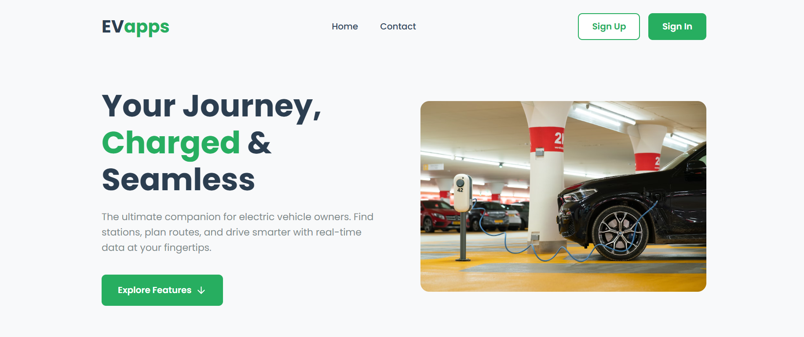
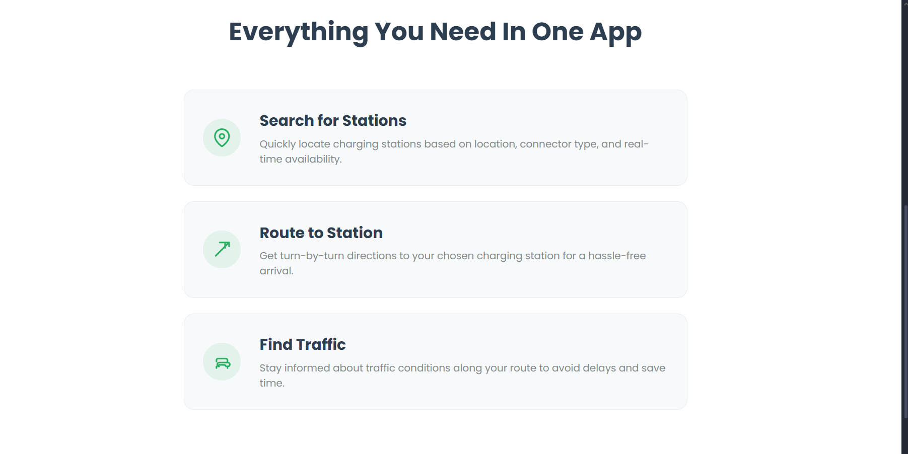

# EV-charging-station-locater
## EV charging:
EV charging involves supply of direct current (DC) to the battery pack. As electricity distribution systems supply alternate current (AC) power, a converter is required to provide DC power to the battery. 
The website aims at providing a user-friendly interface which can be accessed by any user without any limitations. Since the use of Electric vehicles have been increased the need for station locators have become a neccessaary aspect to travel through without any hassels. The website provides assistance in finding the best possible station in and around the place specified.
# Home Page

<!--  -->

# Features of the website

### 1.EV Charging Locator [ Yes ]

The main feature of the website which enables easy access to EV charging station in and around the location the user enters.

### 2.Map Routing [ ]
<!-- 
The feature of the website which enables the user to enroute his journey by specifing the his current loction and the the destination. 

### 3. Traffic Detection

The feature of the website which determines the current traffic status around the specified loction based on the the radius of area mentioned by the user. 

##### The above three features illustrated above depicts the three stages from which the user can inherit the needed information about the electric charging station and find the best route to reach the EV charging station from the website  -->

